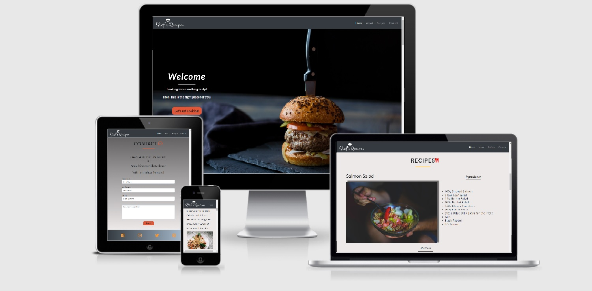

<h1 align="center">Stef's Recipes Website</h1>

This is a static front end project.

It represents what I've learned so far on my journey through [Code Institute's](https://codeinstitute.net/) Full Stack Software Developer program.
I felt highly motivated to combine that knowledge with my other passion- cooking. So I created that website, which purpose is to provide an easy and tasty recipes to the user.

[View the live project here](https://steff880.github.io/MS1-project-Stefs-Recipes/)

---

## UX

### User Stories

-   #### First Time Visitor Goals

    1. As a First Time Visitor, I would like to easily understand what the site is about and what it's purpose is.

    2. As a First Time Visitor, I would like to be able to quickly navigate through the site.

    3. As a First Time Visitor, I would like to see relevent information.

-   #### Returning Visitor Goals

    1. As a Returning Visitor, I would like to find recipes which include full list of ingredients and preparation method.

    2. As a Returning Visitor, I would like to see food images through the site.

    3. As a Returning Visitor, I would like to find social media links where I can share my experience

-   #### Frequent User Goals

    1. As a Frequent User, I would like to see new recipes during period of time.

    2. As a Frequent User, I would like to be able to contact, share recipe ideas and information.

-   ### Design

    -   #### Colour Scheme

        -   Main colours used are white, orange, black

    -   #### Typography

        -   The Lato font is the main font used through the site and Sans Serif is used as a fallback font.

    -   #### Images

        -   The background image for the landing page is used to get user's attention.

        -   Images used in Recipes section are there to show the user how the food will look after following through the instructions.

-   ### Wireframes
    -   Desktop wireframes [view here](https://github.com/steff880/project1/blob/master/assets/wireframes/ms1-desktop-wireframes.png)
    -   Tablet wireframes [view here](https://github.com/steff880/project1/blob/master/assets/wireframes/ms1-tablet-wireframes.png)
    -   Mobile wireframes [view here](https://github.com/steff880/project1/blob/master/assets/wireframes/ms1-mobile-wireframes.png)

---

## Features

-   As the site is responsive, it allows the user to view it on different devices.

-   Having a fixed Navigation Bar let's the user get back to any section of the site.

-   Going through the **Home** section of the site user can quickly navigate to **Recipes** section by clicking the "**_Let's get cooking_**" button.

-   Images

-   Text information

### Features Left to Implement

-   Change the resolution of the logo for better view on mobile devices

---

## Technologies Used

### Languages Used

-   [HTML5](https://en.wikipedia.org/wiki/HTML5)
-   [CSS3](https://en.wikipedia.org/wiki/CSS)

### Frameworks, Libraries & Programs Used

1. [Bootstrap v4.5.3:](https://getbootstrap.com/docs/4.5/getting-started/introduction/)
    - Bootstrap was used to assist with the responsiveness and styling of the website.
1. [Google Fonts:](https://fonts.google.com/)
    - Google fonts were used to import the "Lato" font into the style.css file which is used on all pages throughout the project.
1. [Font Awesome:](https://fontawesome.com/)
    - Font Awesome was used to add icons to the site.
1. [jQuery:](https://jquery.com/)
    - jQuery came with Bootstrap
1. [Git](https://git-scm.com/)
    - Git was used for version control by utilizing the Gitpod terminal to commit to Git and Push to GitHub.
1. [GitHub:](https://github.com/)
    - GitHub is used to store the projects code after being pushed from Git.
1. [Balsamiq:](https://balsamiq.com/)
    - Balsamiq was used to create the [wireframes](https://github.com/steff880/project1/blob/master/assets/wireframes/ms1-desktop-wireframes.png) during the design process.

---

## Testing

### W3C Validator Testing

The W3C Markup Validator and W3C CSS Validator Services were used to validate every page of the project to ensure there were
no syntax errors in the project.

[W3C Markup Validator](https://validator.w3.org/)

-   No errors found [View results here](https://validator.w3.org/nu/?doc=https%3A%2F%2Fsteff880.github.io%2FMS1-project-Stefs-Recipes%2F)

[W3C CSS Validator](https://jigsaw.w3.org/css-validator/)

-   All erorrs and warning are from bootstrap [View results here](https://jigsaw.w3.org/css-validator/validator?uri=https%3A%2F%2Fsteff880.github.io%2FMS1-project-Stefs-Recipes%2F&profile=css3svg&usermedium=all&warning=1&vextwarning=&lang=en)

### Additional Testing

-   Laptop & Desktop

    -   Chrome

        -   All tested and working fine

    -   Edge

        -   All tested and working fine

    -   Opera

        -   All tested and working fine

    -   Firefox

        -   All tested and working fine

    -   Internet Explorer

        -   When tested on this browser found the following errors:

            1.  The text and button on **Home** page are pushed to the left and are not aligned.

            2.  In **Recipes** section text for **_Method_** is pushed to the left and not aligned.

            3.  In the **Footer** of the site, social media icons are pushed to the left and have no
                padding in between.

    -   Tested on Chrome using different devices via google chrome device emulators and all works fine.
    -   Also tested on the folowing physical mobile devices:

        1.  Samsung Galaxy S9 plus and works fine

        2.  Samsung Galaxy s8 and works fine

        3.  Huawei P30 adn works fine

### Testing User Stories

-   #### First Time Visitor Goals

    -   As a First Time Visitor, I would like to easily understand what the site is about and what it's purpose is.

        Upon entering the site, users are automatically greeted with a clean and easily readable navigation bar
        which can lead them to page of their choice. Underneath there is a Hero Image with text and a "Let's get cooking" button.
        Also the site Logo and Hero image give clear information what the site is about.

    -   As a First Time Visitor, I would like to be able to quickly navigate through the site.

        At the top of the page, there is a fixed top navigation bar which can assist user in returning or navigating to
        any section of the site. Also clicking on the Logo, in the top left corner of the navigation bar, will take the user
        back to Home section.

    -   As a First Time Visitor, I would like to see relevent information.

        As the site is about Recipes and food, therefore all information and images used are of food as well.

-   ### Returning Visitor Goals

    -   As a Returning Visitor, I would like to find recipes which include full list of ingredients and preparation method.

        By clicking on the Recipes link on the navigation bar ot by clicking the "**Let's get cooking**" call to action button
        on the Home screen, will take the user to Recipes section, where can find recipes with fill list of ingredients and
        also method of preparation.

    -   As a Returning Visitor, I would like to see food images through the site.

        Upon entering the site, user is greeted with a full page background image of food. Also by scrolling down user can
        enjoy ohter beautiful images of food.

    -   As a Returning Visitor, I would like to find social media links where I can share my experience

        At the footer of the site are placed social media links, where user can share their experience.

-   ### Frequent User Goals

    -   As a Frequent User, I would like to see new recipes during period of time.

        By going to Recipes section, user can see all of the recipes currently on site.

    -   As a Frequent User, I would like to be able to contact, share recipe ideas and information.

        By clicking on Contact link in the navigation bar, user will be taken to the Contact section of the site. There
        user can fill up a form and leave a message or share an idea.

---

## Deployment

### GitHub Pages

-   Following steps were used:

    1. First login to [GitHub](https://github.com/)
    2. Locate the **Repository** and click on settings.
    3. Scroll down the settings page till you see GitHub Pages.
    4. Then under source choose **_master_** branch by clicking the button.
    5. Click Save and wait for the page to refresh.
    6. Scroll down again to GitHub pages.
    7. Find the URL for the site under GitHub pages.

### Fork It

1. Login to [GitHub](https://github.com/)
2. Locate the **Repository**.
3. In the top right corner click **_Fork_** button.

### Clone It

1. Login to [GitHub](https://github.com/)
2. Fork the Repository.
3. Then click **Code** under _Settings_ button.
4. Choose HTTPS, SSH, or GitHub CLI, then click the copy button to the right.
5. Open Git Bash
6. Change the directory to the location where you want the cloned directory to be made.
7. Type _git clone_ and paste the URL you coppied before.
8. To create the clone press _Enter_

---

## Credits

### Code

-   Code for full page background image found on https://css-tricks.com/perfect-full-page-background-image/, also found in the videos for [Whiskey Drop](https://courses.codeinstitute.net/courses/course-v1:codeinstitute+FE+2017_T3/courseware/a4b90d17e5c94220a0f83f00ce7fa606/2aca2c94a518427495cc1b4bc641ccbf/?child=first) website lesson
    and modified to fit project needs.

-   Code for linear-gradient background taken from https://www.w3schools.com/css/css3_gradients.asp and modified to fit project needs

-   Code for responsive image taken from https://www.w3schools.com/css/css_rwd_images.asp and modified to fit project needs.

-   [Bootstrap](https://getbootstrap.com/docs/4.5/getting-started/introduction/): Bootstrap Library used throughout the project mainly to make site responsive using the Bootstrap Grid System.

-   [Autoprefixer CSS online](https://autoprefixer.github.io/) - Used to add vendor prefixes to my css code.

-   Code for navbar taken from [Whiskey Drop](https://courses.codeinstitute.net/courses/course-v1:codeinstitute+FE+2017_T3/courseware/a4b90d17e5c94220a0f83f00ce7fa606/2aca2c94a518427495cc1b4bc641ccbf/?child=first) website lesson, also found in [Bootstrap](https://getbootstrap.com/docs/4.5/components/navbar/#nav)

### Content

-   All content was written by the developer

### Media

-   #### Logo

    -   Used [Free Logo Design](https://www.freelogodesign.org/) to create the logo for the site.

-   #### Images

    -   Home section image taken from:

        -   Photo by Lidye on [Unsplash](https://unsplash.com/photos/1Shk_PkNkNw)

    -   About section image taken from:

        -   Photo by Lisa Fotios from [Pexels](https://www.pexels.com/photo/selective-focus-photography-of-pasta-with-tomato-and-basil-1279330/)

    -   Recipes section images taken from:

        -   Photo by Kaboompics .com from [Pexels](https://www.pexels.com/photo/eating-salad-6086/)
        -   Photo by Brett Jordan from [Pexels](https://www.pexels.com/photo/pizza-on-brown-wooden-board-825661/)
        -   Photo by Tina Guina on [Unsplash](https://unsplash.com/photos/s8_7AqkzCWY)

    -   The responsive image of the site taken from [Am I Responsive](http://ami.responsivedesign.is/?url=https%3A%2F%2Fsteff880.github.io%2Fproject1%2F#)

### Acknowledgements

-   My mentor, Adegbenga Adeye, for continuous helpful feedback and support.
-   The team at Code Institute, for teaching me the necessary skills to create this site.
-   @JimLynx_lead from the Slack community, for his helpful sessions on MS1 planning and how to use Git and Github
-   Used [Whiskey Drop Lesson](https://courses.codeinstitute.net/courses/course-v1:codeinstitute+FE+2017_T3/courseware/a4b90d17e5c94220a0f83f00ce7fa606/2aca2c94a518427495cc1b4bc641ccbf/?child=first) and [Resume Project](https://courses.codeinstitute.net/courses/course-v1:codeinstitute+FE+2017_T3/courseware/616289d66b5641a3808cc43e53842695/36e3366dbdaf40fd852994c51f9f8595/?activate_block_id=block-v1%3Acodeinstitute%2BFE%2B2017_T3%2Btype%40sequential%2Bblock%4036e3366dbdaf40fd852994c51f9f8595) for ideas and inspiration.
-   [w3schools](https://www.w3schools.com/default.asp) for all the usefull information found on thr site.
